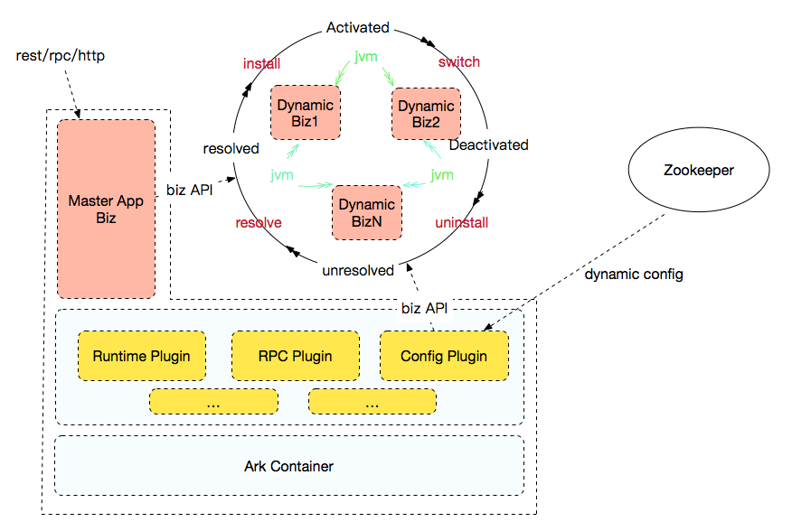

# SOFAArk Project

SOFAArk 是一款基于 Java 实现的轻量级类隔离容器，由蚂蚁金服公司开源贡献；主要提供类隔离和应用（模块）动态部署能力；基于 [Fat Jar](https://docs.spring.io/spring-boot/docs/current/reference/html/executable-jar.html#executable-jar-jar-file-structure) 技术，可以将多个应用（模块）打包成一个自包含可运行的 Fat Jar，应用既可以是简单的单模块 Java 应用也可以是 Spring Boot/SOFABoot 应用；[访问网址](https://www.sofastack.tech/sofa-boot/docs/sofa-ark-readme?lang=zh-cn)进入快速开始并获取更多详细信息；

## 背景
日常使用 Java 开发，常常会遇到包依赖冲突的问题，尤其当工程应用变得臃肿庞大，包冲突的问题也会变得更加棘手，导致各种各样的报错，例如`LinkageError`, `NoSuchMethodError`等；实际开发中，可以采用多种方法来解决包冲突问题，比较常见的是类似 SpringBoot 的做法，统一管理应用所有依赖包的版本，保证这些三方包不存在依赖冲突；这种做法只能有效避免包冲突的问题，不能根本上解决包冲突的问题；如果某个应用的确需要在运行时使用两个相互冲突的包，例如 `protobuf2` 和 `protobuf3`，那么类似 SpringBoot 的做法依然解决不了问题；

为了彻底解决包冲突的问题，我们需要借助类隔离机制，使用不同的 ClassLoader 加载不同版本的三方依赖，进而隔离包冲突问题；OSGI 作为业内最出名的类隔离框架，自然是可以被用于解决上述包冲突问题，但是 OSGI 框架太过臃肿，功能繁杂；为了解决包冲突问题，引入 OSGI 框架，有牛刀杀鸡之嫌，反而使工程变得更加复杂，不利于开发；

SOFAArk 则采用较为轻量级的类隔离方案来解决日常经常遇到的包冲突问题，在蚂蚁金服内部服务于整个 [SOFABoot](https://github.com/sofastack/sofa-boot) 技术体系，弥补 SpringBoot 没有的类隔离能力。实际上，SOFAArk 是一个通用的轻量级类隔离框架，并不限于 SpringBoot 应用，也可以和其他的 Java 开发框架集成；

基于 SOFAArk 提供的类隔离能力，SOFAArk 支持将多个应用合并打成一个可执行的 Fat Jar 包，也支持运行时通过 API 或者 Zookeeper 动态推送配置达到动态部署应用(模块)的能力。在多团队协作开发时，各个功能模块由不同的团队负责开发，通常情况下，这些功能模块独立开发，但是运行时部署在一起。借助 SOFAArk 提供的合并部署能力，各团队开发时拥有相当大自由度，只需要定义各模块之间的交互接口即可，尤其对于中台应用开发，提高团队合作效率。除了合并部署，SOFAArk 对接了 Zookeeper 接受动态配置，控制应用(模块)的安装和卸载。

## 原理
SOFAArk 框架包含有三个概念，`Ark Container`, `Ark Plugin` 和 `Ark Biz`; 运行时逻辑结构图如下： 

在介绍这三个概念之前，为了统一术语，有必要先说一下所谓的 `Ark 包`；Ark 包是满足特定目录格式要求的 `Executed Fat Jar`，使用官方提供的 `Maven` 插件 `sofa-ark-maven-plugin`可以将工程应用打包成一个标准格式的 `Ark 包`；使用命令 `java -jar application.jar`即可在 Ark 容器之上启动应用；`Ark 包` 通常包含 `Ark Container`、`Ark Plugin`、 `Ark Biz`；以下我们针对这三个概念简单做下名词解释：

+ `Ark Container`: Ark 容器，负责整个运行时的管理；`Ark Plugin` 和 `Ark Biz` 运行在 Ark 容器之上；容器具备管理多插件、多应用的功能；容器启动成功后，会自动解析 classpath 包含的 `Ark Plugin` 和 `Ark Biz` 依赖，完成隔离加载并按优先级依次启动之；

+ `Ark Plugin`: Ark 插件，满足特定目录格式要求的 `Fat Jar`，使用官方提供的 `Maven` 插件 `sofa-ark-plugin-maven-plugin` 可以将一个或多个普通的 `Java  Jar` 包打包成一个标准格式的 `Ark Plugin`； `Ark Plugin` 会包含一份配置文件，通常包括插件类导入导出配置、插件启动优先级等；运行时，Ark 容器会使用独立的 `PluginClassLoader` 加载插件，并根据插件配置构建类加载索引表，从而使插件与插件、插件与应用之间相互隔离；

+ `Ark Biz`: Ark 业务模块，满足特定目录格式要求的 `Fat Jar` ，使用官方提供的 `Maven` 插件 `sofa-ark-maven-plugin` 可以将工程应用打包成一个标准格式的 `Ark-Biz` 包；是工程应用模块及其依赖包的组织单元，包含应用启动所需的所有依赖和配置；

在运行时，`Ark Container` 优先启动，自动解析 classpath 包含的 `Ark Plugin` 和 `Ark Biz`，并读取他们的配置，构建类加载索引关系；然后使用独立的 ClassLoader 加载他们并按优先级配置依次启动；需要指出的是，`Ark Plugin` 优先 `Ark Biz` 被加载启动；`Ark Plugin` 之间是双向类索引关系，即可以相互委托对方加载所需的类；`Ark Plugin` 和 `Ark Biz` 是单向类索引关系，即只允许 `Ark Biz` 索引 `Ark Plugin` 加载的类，反之则不允许。

## 场景
#### 包冲突
SOFAArk初衷是为了解决包冲突问题，那什么情况下可以使用 SOFAArk 以及如何使用呢？ 假设如下场景，如果工程需要引入两个三方包：A 和 B，但是 A 需要依赖版本号为 0.1 的 C 包，而恰好 B 需要依赖版本号为 0.2 的 C 包，且 C 包的这两个版本无法兼容:

此时，即可使用 SOFAArk 解决该依赖冲突问题；只需要把 A 和版本为 0.1 的 C 包一起打包成一个 `Ark Plugin`，然后让应用工程引入该插件依赖即可；

#### 合并部署
SOFAArk 基于类隔离能力，实现了应用的合并部署，可以简单分为静态合并部署和动态合并部署，介绍如下。

##### 静态合并部署
在实际开发过程中，经常会出现多个团队合作开发同一款产品，他们各自负责不同的功能模块，这些功能模块通常可以独立开发，但是运行时需要作为一个整体的应用运行。在这种情况下，所有团队需要协商统一技术栈及各自的二方包版本，这无疑增加了开发和联调的成本。为了让开发人员专注自身功能业务的开发，理想情况下开发人员希望能像开发独立应用一样，仅定义好对外交互接口，而不用考虑和其他功能模块出现的版本冲突、技术栈不统一等问题。正是基于这种场景，SOFAArk 提供了静态合并部署能力，应用可以依赖其他应用打成的 Biz 包，而当自身被打成 Ark 包时，可以将其他应用 Biz 包一并打入，启动时，则会根据优先级依次启动各应用。由于每个应用使用独立的 BizClassLoader 加载，因此不需要考虑依赖冲突或者技术栈不统一问题。应用之间则通过 `SofaService/SofaRefernece` JVM 服务进行交互。

##### 动态合并部署
动态合并部署区别于静态合并部署最大的一点是，运行时通过 API 或者配置中心（Zookeeper）来控制应用的部署和卸载。动态合并部署的设计理念图如下：

无论是静态还是动态合并部署都会有宿主应用（master app）的概念, 如果 Ark 包只打包了一个 Biz，则该 Biz 默认成为宿主应用；如果 Ark 包打包了多个 Biz 包，需要配置指定宿主应用。宿主应用不允许被卸载，一般而言，宿主应用会作为流量入口的中台系统，具体的服务实现会放在不同的动态 Biz 中，供宿主应用调用。宿主应用可以使用 SOFAArk 提供的客户端 API 实现动态应用的部署和卸载。除了 API, SOFAArk 提供了 Config Plugin，用于对接配置中心（目前支持 Zookeeper），运行时接受动态配置；Config Plugin 会解析下发的配置，控制动态应用的部署和卸载。

## 快速开始
* [样例工程](sofa-ark-samples)
  * [基于普通的 Maven 应用构建 Ark Plugin](sofa-ark-samples/sample-ark-plugin)
  * [基于 SpringBoot 应用使用 SOFAArk](sofa-ark-samples/sample-springboot-ark)
 
## 社区
* [Gitter channel](https://gitter.im/sofa-ark/Lobby) 
* [Issues](https://github.com/sofastack/sofa-ark/issues)

## 贡献
* [代码贡献](./CONTRIBUTING.md) : SOFAArk 开发参与说明书

## 文档
* [SOFAArk 用户手册(中文)](http://www.sofastack.tech/sofa-boot/docs/sofa-ark-readme) : SOFAArk 用户手册及功能特性详细说明

## 致谢
SOFAArk 类隔离框架设计实现主要基于 OSGi 规范及蚂蚁金服的 CloudEngine 容器；同时也参考了 Spring Boot 及阿里的 PandoraBoot，感谢以上产品工作者的辛勤付出。
