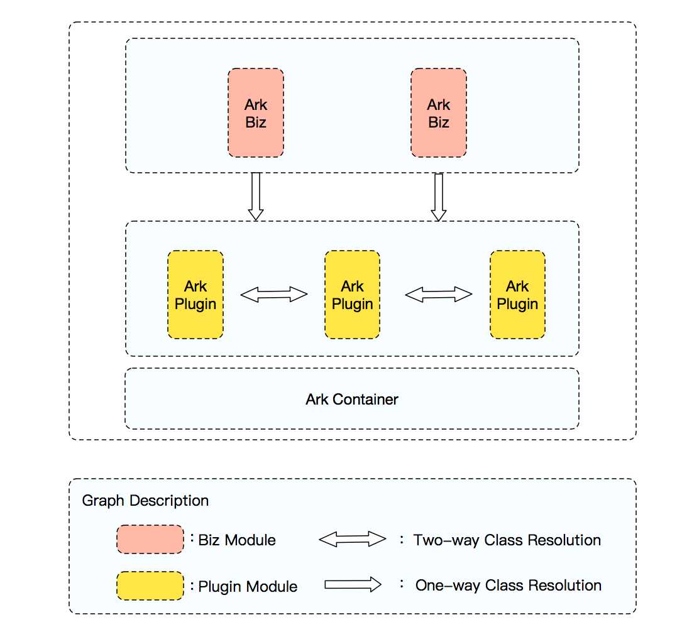
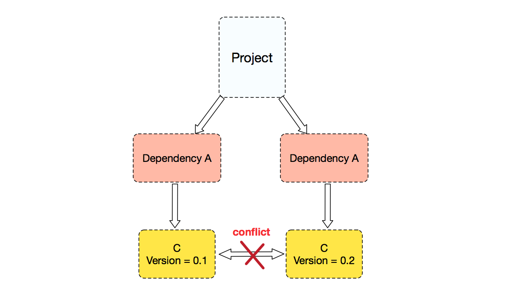

# SOFAArk Project

SOFAArk is a light-weight，java based classloader isolation framework 
open sourced by Ant Financial. Please visit [https://alipay.github.io/sofastack.github.io/](https://alipay.github.io/sofastack.github.io/)

## Background

In Java world, dependency is always a problem, and can cause various errors, such as `LinkageError`, `NoSuchMethodError` etc. There are many ways to solve the dependency problems, the Spring Boot's way is using a dependency management to manage all the dependencies, make sure that all the dependencies in the dependency management will not conflict and can work pretty well. This is quite a simple and efficient way, it can cover most scenario, but there is some exceptions.

For example, there is a project that need protobuf version 2 and protobuf version 3, and because protobuf version 3 is not compatible with version 2, so the project can not simply upgrade the protobuf to version 3 to solve the problem. There is same problem for hessian version 3 and version 4.

To cover those exceptions, we need to introduce a classloader isolation way, make different version of a framework loaded by different classloader. There are many framework that can do classloader isolation, perhaps the most famous one is OSGi, but OSGi classloader schema is too complex, beside classloader isolation, it also has ability to do hot deploy and a lot of other functionalities that we actually don't want.

So this is the origin of SOFAArk, it's goal is to use a light-weight classloader isolation mechanism to solve the problem that Spring Boot did not solve. And just a remind that SOFAArk is not bind to Spring Boot, actually it is a more general classloader isolation framework that can be used with any other frameworks too.

## How SOFAArk Works

There are three concepts in SOFAArk: `Ark Container`, `Ark-Plugin` and `Ark-Biz`; they are organized as what the following graph shows:

First of all, we explain what roles these concepts play;

+ `Ark Container`: It's the runtime manager of total framework; it will startup in the first place, then it resolves `Ark Plugin` and `Ark Biz` in classpath and deploys them.

+ `Ark Plugin`: A fat jar packaged by `sofa-ark-plugin-maven-plugin`, generally it would bring with a class-index configuration which describes what class would be exported and imported. `Ark Plugin` can resolve classes from each other.

+ `Ark Biz`: A fat jar packaged by `sofa-ark-maven-plugin`, it mainly contains all staff what a project need in runtime. `Ark Biz` can resolve classes form `Ark Plugin`, but not inverse.

In runtime, `Ark Container` would automatically recognize `Ark-Plugin` and `Ark-Biz` in classpath, and load them with the independent classloader. According to configurations brought by `Ark Plugin` and `Ark Biz`, `Ark Container` would build a class-index table, so they can be
isolated well. For example, if a project has two dependencies of A and B, but A depends on C (version = 0.1) and B depends on C (version = 0.2), so conflicts maybe emerge.

In this situation, we just repackage the dependencies of A and C(version=0.1) as an ark-plugin, and add the dependency of the `ark-plugin` to project, then this conflict would be avoided.

## Sample

* [Sample projects](sofa-ark-samples)
    * [Ark Plugin Based On Maven Project](sofa-ark-samples/sample-ark-plugin) - Sample Project for Ark-Plugin
    * [Ark Based On Spring Boot](sofa-ark-samples/sample-springboot-ark) Sample Project for Ark based on Spring Boot Project

## Community

* [Gitter channel](https://gitter.im/sofa-ark/Lobby) - Online chat room with SOFAArk developers.
* [Issues](https://github.com/alipay/sofa-ark/issues)

## Contribution

* [Contributing](./CONTRIBUTING.md) : Guides for contributing to SOFAArk.

## Documentation

* [SOFAArk 用户手册(中文)](https://alipay.github.io/sofastack.github.io/docs/): Describe how to used SOFAArk and its features.
