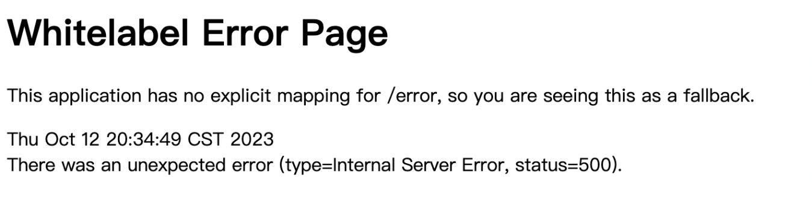
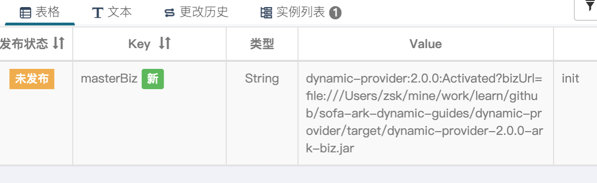
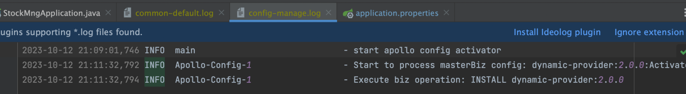
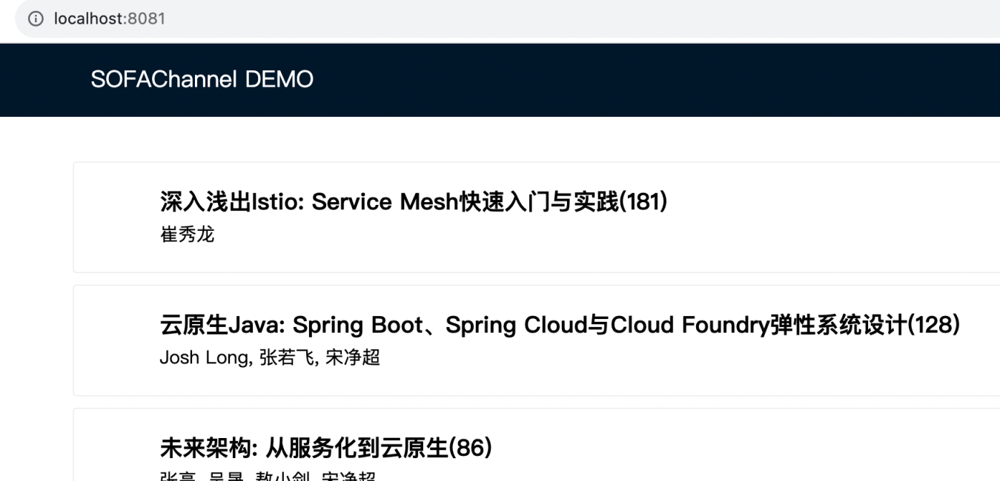

# 通过Apollo管理SOFAArk模块安装

## 项目准备
#### apollo-quick-start
使用[sofa-ark-dynamic-guides](https://github.com/apolloconfig/apollo-quick-start)项目 来创建apollo本地配置中心
#### sofa-ark-dynamic-guides
使用[sofa-ark-dynamic-guides](https://github.com/sofastack-guides/sofa-ark-dynamic-guides)作为演示模块动态安装的目标业务项目

## 配置与准备
### sofa-ark-dynamic-guides项目配置

- 修改dynamic-stock-mng中application-properties
```
#8080和apollo的config service服务端口冲突
server.port=8081  

#新增apollo客户端配置
app.id=SampleApp
apollo.meta=http://localhost:8080
```

- 参考 [SOFAArk 配置](https://www.sofastack.tech/projects/sofa-boot/sofa-ark-ark-config/)，在 dynamic-stock-mng目录下新增文件 `${baseDir}/conf/ark/bootstrap.properties`；并增加如下配置，设置使用apollo作为配置中心
```
sofa.ark.config.server.type=apollo
```

- 新增config-ark-plugin项目的pom.xml依赖

```
<dependency>
  <groupId>com.alipay.sofa</groupId>
  <artifactId>config-ark-plugin</artifactId>
  <version>${sofa.ark.version}</version>
</dependency>
<dependency>
    <groupId>com.ctrip.framework.apollo</groupId>
    <artifactId>apollo-client</artifactId>
    <version>2.1.0</version>
</dependency>
```
- 增加dynamic-stock-mng的pom.xml依赖
```
 <dependency>
    <groupId>com.alipay.sofa</groupId>
    <artifactId>config-ark-plugin</artifactId>
</dependency>
<dependency>
    <groupId>com.ctrip.framework.apollo</groupId>
    <artifactId>apollo-client</artifactId>
</dependency>
```
### apollo后台启动配置

- 按照文档apollo-quick-start文档启动apollo
```
zsk@MC267220 apollo-quick-start % ./demo.sh start
==== starting service ====
Service logging file is ./service/apollo-service.log
Started [1225]
Waiting for config service startup......
Config service started. You may visit http://localhost:8080 for service status now!
Waiting for admin service startup.
Admin service started
==== starting portal ====
Portal logging file is ./portal/apollo-portal.log
Started [1343]
Waiting for portal startup....
Portal started. You can visit http://localhost:8070 now!
```

- 需要额外在Apollo后台为应用独立创建一个管理SOFAArk的Namespace
    - Namespace的名称为sofa-ark
- 创建key-value来管理SOFAArk 的模块加载，
    -  key的名字必须为masterBiz， 类型为String
    - value初始值为空
  
## 验证
### 启动StockMngApplication基座
参考 [启动宿主应用 ](https://github.com/sofastack-guides/sofa-ark-dynamic-guides#4%E6%89%93%E5%8C%85--%E5%90%AF%E5%8A%A8%E5%AE%BF%E4%B8%BB%E5%BA%94%E7%94%A8)
### 连接 SOFAArk telnet
```
## 连接 SOFAArk telnet
> telnet localhost 1234

## 查看安装的模块信息
sofa-ark>biz -a
stock-mng:1.0.0:activated
biz count = 1
```
此时访问[http://localhost:8081/](http://localhost:8081/) 报错


### 通过apollo后台安装biz模块
#### 安装dynamic-provider模块
为上述Namespace为ark-biz 中的masterBiz设置一下值，然后进行发布。


### 验证结果
#### 检查日志
找到logs/stock-mng/sofa-ark/config-message.log


可以看到apollo后台推送的指令已经被执行

#### biz模块检查
再次允许biz -a， 确认dynamic-provider模块已经安装成功

```
sofa-ark>biz -a 
dynamic-provider:2.0.0:activated
stock-mng:1.0.0:activated
biz count = 2
```

#### 访问服务[http://localhost:8081/](http://localhost:8081/)
再次刷新页面，页面现在可以正常访问。至此，整个演示结束。



